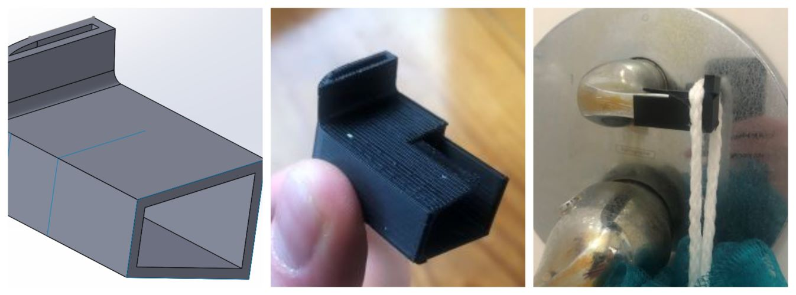

# 3DPrints
Catalog of various custom 3D models created by me

Click on any folder to see more information about a print.

Each folder contains:

- A .STL file of every iteration where you can view the 3D modeled part and it's design history
- A change log that gives initial context of how each part came to be and a version history written description
- Picture of the situation before the print
- Picture of the result after printing
- Picture of the print in use if applicable

## Gallery

